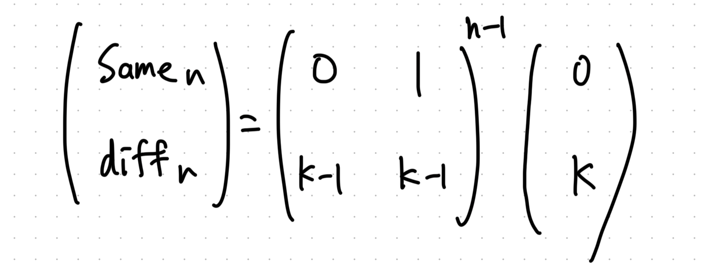

## Step1
- 以前はファイルを分けていたが、今回から全ての思考過程を一つのmdファイルにまとめてみる

- 考えたこと
    - 場合分けして、漸化式を立式
    - あとはテーブルを作って bottom-up DP
    - いつも書く書き方だと2行のテーブルを作るが、可読性を考えてそれぞれ名前を付けて工夫してみた
        - 変数名は迷ったが、`num_ways_same` と `num_ways_diff` としてみた。`same` と `diff` だけでもいいかもしれない
```python
class Solution:
    def numWays(self, n: int, k: int) -> int:
        # when the (i-1)-th and i-th posts are same colors
        num_ways_same = [0] * (n + 1)
        # when the (i-1)-th and i-th posts are different colors
        num_ways_diff = [0] * (n + 1)

        # recurrence relation
        # num_ways_same[i + 1] = num_ways_diff[i], num_ways_diff[i + 1] = (num_ways_same[i] + num_ways_diff[i]) * (k - 1)
        # initial conditions
        # num_ways_diff[1] = k, num_ways_same[1] = 0

        num_ways_same[1] = 0
        num_ways_diff[1] = k
        for i in range(1, n):
            num_ways_same[i + 1] = num_ways_diff[i]
            num_ways_diff[i + 1] = (num_ways_same[i] + num_ways_diff[i]) * (k - 1)
        return num_ways_same[-1] + num_ways_diff[-1]
```

- 考えたこと2
    - 今回のarai60のDP演習では top-down DP も簡単に書けるように練習したい
        - 以前、Pramp で模擬面接をしたときに bottom-up DP を書いたことがあるが説明に苦労した
        - 可読性の観点では、top-down DP（メモ化再帰）の方に分があると思っている

```python
class Solution:
    def numWays(self, n: int, k: int) -> int:
        @cache
        def num_ways_helper(n, k) -> tuple[int]:
            if n == 1:
                return 0, k
            same, diff = num_ways_helper(n - 1, k)
            new_same = diff
            new_diff = (same + diff) * (k - 1)
            return new_same, new_diff

        return sum(num_ways_helper(n, k))
```

- 考えたこと3
    - ここで今回の場合だと、n -> n + 1 の遷移しかないため、配列の使いまわしが出来ることに気づいた
        - メモリ最適化までは面接で求められている気がするので、初手の段階でちゃんと書けるようにしておきたい
    - 変数名を `same` と `diff` にしてシンプルにしてみた

```python
class Solution:
    def numWays(self, n: int, k: int) -> int:
        same = 0
        diff = k
        for _ in range(n - 1):
            next_same = diff
            next_diff = (same + diff) * (k - 1)
            same = next_same
            diff = next_diff
        return same + diff
```


## Step2
- 過去ログを参照
    - https://github.com/TORUS0818/leetcode/pull/32
    - https://github.com/Yoshiki-Iwasa/Arai60/pull/44
        >あー、あと、この問題、行列の n 乗なので、そういう方法でも計算できるはずです。
        - たしかに、行列のn乗として表現出来る
        - 行列累乗は繰り返し二乗法で O(log n) で計算出来るので本質的な計算量削減につながりそう
    - https://github.com/goto-untrapped/Arai60/pull/44
        >前と違う色を塗り分ける時は、1個前までの組み合わせ数×(k-1)通りで、前と同じ色を塗る時は2個前までの組み合わせ数×(k-1)×1通り、の和
        - 実は、fibonacci numbers pattern に落とし込める
        - いきなり思いつくことは難しそうな印象を受けた

        >フィボナッチ数列に関連して、 時間計算量 O(log n) の解法は思いつきますか？
        - こちらも行列累乗の話かな
        - 行列演算でもやってみる

```python
import numpy as np

class Solution:
    def numWays(self, n: int, k: int) -> int:
        A = np.array([[0, 1], [k - 1, k - 1]])
        v = np.array([0, k])
        return np.sum(np.linalg.matrix_power(A, n - 1) @ v)
```



- 行列累乗はnumpyで
    - matrix_power
        - https://numpy.org/doc/2.0/reference/generated/numpy.linalg.matrix_power.html
- 計算量的には O(n) -> O(log n) と落ちるはずだがleetcode上ではむしろ遅くなった
    - n <= 50 と小さいからかな

## Step3
- メモリ最適化した bottom-up DP で
```python
class Solution:
    def numWays(self, n: int, k: int) -> int:
        same = 0
        diff = k
        for _ in range(n - 1):
            next_same = diff
            next_diff = (k - 1) * (same + diff)
            same = next_same
            diff = next_diff
        return same + diff
```

